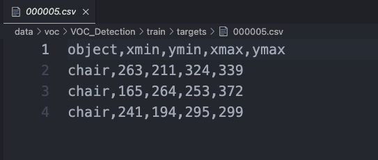

# YOLO v1: 从零开始的 PyTorch 实现
本仓库实现了论文 [You Only Look Once: Unified, Real-Time Object Detection](https://arxiv.org/abs/1506.02640) 中的内容，使用 PyTorch。代码遵循 [Darknet](https://github.com/pjreddie/darknet) 仓库的官方实现，与论文相比有一些细微差别：

- 最重要的区别在于模型的架构。具体来说，第一个全连接层被局部连接层取代。在论文中，YOLO 模型的架构如下：
<p align="center" width="100%">  </p>

- 在每个卷积层中，卷积操作后和激活函数之前使用了批量归一化操作。
- 学习率调度和网络训练的最大批次。

本仓库从零开始实现了论文中的内容，包括：
+ 使用 VOC 训练集（train/val 2007 + train/val 2012）进行训练，以及
+ 使用 VOC 测试集（test 2007）进行评估

## 安装环境
```
pip install -r requirements.txt
```


## 数据集准备
### PASCAL VOC 2007 + PASCAL VOC 2012 数据集
要下载和准备 VOC 数据集，请按以下顺序运行脚本：


```
./download_voc.sh ./data/voc
./organize_voc.sh ./data/voc
python3 simplify_voc_targets.py ./data/voc
```

数据转换后的csv如下图所示：


## 已完成部分
1. 已完成VOC数据集导入
2. 各模块的代码撰写与网络结构的拼接

## 需要完善部分
1. 还需要适配COCO数据集
